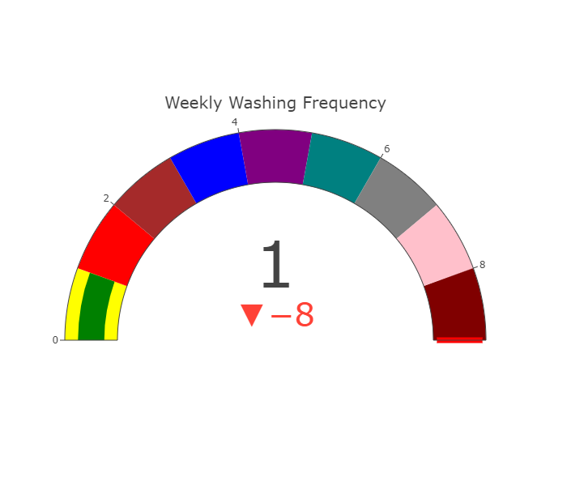

# Plot.ly Homework - Belly Button Biodiversity

In this assignment, I built an interactive dashboard to explore the [Belly Button Biodiversity dataset](http://robdunnlab.com/projects/belly-button-biodiversity/), which catalogs the microbes that colonize human navels.

This dataset reveals that a small handful of microbial species (also called operational taxonomic units, or OTUs, in the study) were present in more than 70% of people, while the rest were relatively rare.

## Step 1: Plotly

1. Used the D3 library to read in `samples.json`.

2. Created a horizontal bar chart with a dropdown menu to display the top 10 OTUs found in that individual.

* Used `sample_values` as the values for the bar chart.

* Used `otu_ids` as the labels for the bar chart.

* Used `otu_labels` as the hovertext for the chart.

  

3. Created a bubble chart that displays each sample.

* Used `otu_ids` for the x values.

* Used `sample_values` for the y values.

* Used `sample_values` for the marker size.

* Used `otu_ids` for the marker colors.

* Used `otu_labels` for the text values.

4. Displayed the sample metadata, i.e., an individual's demographic information.

5. Displayed each key-value pair from the metadata JSON object somewhere on the page.

6. Update all of the plots any time that a new sample is selected.

The index file provided was used to create the dashboard.

## Advanced Challenge Assignment (Optional)

The following task is advanced and therefore optional.  I chose to do the advanced portion of this assignment from the beginning and is built into the original app file.  

* Adapted the Gauge Chart from <https://plot.ly/javascript/gauge-charts/> and changed it to fit my style and ajusted it to plot the weekly washing frequency of the individual.  Additionaly, my plot shows a delta from the max value of the chart at 9. 

* The code was modified from the example gauge code to account for values ranging from 0 through 9.

* The gauge chart updates everytime whenever a new sample is selected.

## Deployment

* Deployed my app to a free static page hosting service, such as GitHub Pages. Submited the links to my deployment and my GitHub repo to the bootcamp spot upload.

* Ensure your repository has regular commits (i.e. 20+ commits) and a thorough README.md file

## Hints

* Used `console.log` inside of my JavaScript code to see what my data looks like at each step.  Once used, it was then blocked from running each time.

* Refer to the [Plotly.js documentation](https://plot.ly/javascript/) when building the plots.

### About the Data

Hulcr, J. et al.(2012) _A Jungle in There: Bacteria in Belly Buttons are Highly Diverse, but Predictable_. Retrieved from: [http://robdunnlab.com/projects/belly-button-biodiversity/results-and-data/](http://robdunnlab.com/projects/belly-button-biodiversity/results-and-data/)

- - -

© 2019 Trilogy Education Services
